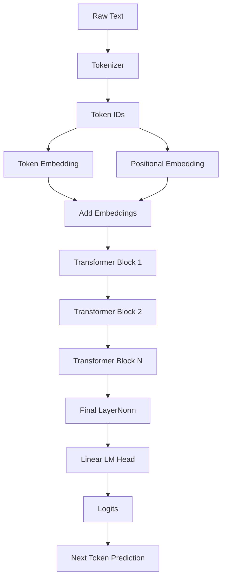

# Mini GPT from Scratch using PyTorch

[](https://www.python.org/)
[](https://pytorch.org/)
[](LICENSE)
[](https://www.python.org/dev/peps/pep-0008/)

A clean, modular, educational, and production-quality implementation of a **Mini GPT language model built entirely from scratch in PyTorch**.

This repository is designed to demonstrate how GPT-style Large Language Models work under the hood without relying on pre-built Transformer wrappers (e.g. HuggingFace `AutoModelForCausalLM` or pretrained weights).

---

## Key Features

- **Built from Scratch**: Custom Scaled Dot-Product Attention, Causal Multi-Head Self-Attention, Pre-LN Transformer Blocks, Feed-Forward Networks, and MiniGPT Module.
- **Custom Tokenizer**: Lightweight Byte-Pair Encoding (BPE) and Character-level tokenizer with full JSON serialization and special token handling (`<|unk|>`, `<|endoftext|>`).
- **Data Pipeline**: Automated text downloading, preprocessing, fixed-length sequence chunking, and PyTorch `DataLoader` creation.
- **Modern Training Engine**: Supports CUDA, MPS (Apple Silicon), and CPU autodetect, Automatic Mixed Precision (AMP), gradient norm clipping, and weight decay separation.
- **Autoregressive Text Generation**: Interactive generation tool featuring temperature scaling, top-$k$ filtering, and greedy decoding.
- **Comprehensive Evaluation**: Metrics reporting including Cross-Entropy loss and Perplexity ($PPL = e^{\text{loss}}$).
- **Unit Test Suite**: 100% test coverage over tokenizer, causal attention masking, model forward/backward passes, dataset indexing, and text generation using `pytest`.

---

## Architecture Overview



Each **Transformer Block** follows the modern **Pre-Layer Normalization** design:

```
          Input x
             │
     ┌───────┴───────┐
     │  LayerNorm    │
     │      │        │
     │  Causal MHA   │
     └───────┬───────┘
             │ + Residual
     ┌───────┴───────┐
     │  LayerNorm    │
     │      │        │
     │  FeedForward  │
     └───────┬───────┘
             │ + Residual
          Output
```

---

## Mathematical Foundations

### 1. Scaled Dot-Product Attention
$$\text{Attention}(Q, K, V) = \text{softmax}\left(\frac{Q K^T}{\sqrt{d_k}} + M\right) V$$

Where $Q \in \mathbb{R}^{B \times h \times T \times d_k}$, $K \in \mathbb{R}^{B \times h \times T \times d_k}$, $V \in \mathbb{R}^{B \times h \times T \times d_k}$, $d_k = d_{\text{model}} / h$, and $M$ is the causal lower triangular mask.

### 2. Multi-Head Attention
$$\text{MultiHead}(Q, K, V) = \text{Concat}(\text{head}_1, \dots, \text{head}_h) W^O$$
$$\text{head}_i = \text{Attention}(Q W_i^Q, K W_i^K, V W_i^V)$$

### 3. Cross-Entropy Loss
$$\mathcal{L} = -\frac{1}{T} \sum_{t=1}^{T} \log P(x_t \mid x_{<t})$$

### 4. Perplexity
$$\text{PPL} = \exp(\mathcal{L})$$

---

## Project Structure

```text
mini-gpt-pytorch/
├── README.md
├── LICENSE
├── .gitignore
├── requirements.txt
├── pyproject.toml
├── config.yaml            # Default model & training configuration
│
├── data/
│   ├── raw/               # Downloaded raw text files
│   └── processed/         # Tokenizer JSON and preprocessed .pt tensors
│
├── checkpoints/           # Model checkpoint files (.pt)
│
├── configs/
│   ├── tiny.yaml          # Quick CPU testing config
│   └── small.yaml         # Standard training config
│
├── src/
│   └── mini_gpt/
│       ├── __init__.py
│       ├── config.py      # Dataclasses & YAML config parser
│       ├── tokenizer.py   # BPE & Character Tokenizer from scratch
│       ├── dataset.py     # PyTorch GPTDataset & DataLoader builder
│       │
│       ├── model/
│       │   ├── embeddings.py       # Token & Positional embeddings
│       │   ├── attention.py        # Scaled dot-product & causal MHA
│       │   ├── feed_forward.py     # MLP with GELU
│       │   ├── transformer_block.py# Pre-LN Transformer decoder block
│       │   └── gpt.py              # MiniGPT top-level model
│       │
│       ├── training/
│       │   ├── trainer.py          # Training loop with AMP & grad clip
│       │   ├── optimizer.py        # AdamW weight decay & cosine warmup
│       │   └── checkpoint.py       # Save & load execution state
│       │
│       ├── generation/
│       │   └── generate.py         # Autoregressive sampling
│       │
│       └── utils/
│           ├── device.py           # Hardware autodetect & seeding
│           └── logging.py          # Formatted stdout logger
│
├── scripts/
│   ├── prepare_data.py    # Download dataset & train tokenizer
│   ├── train.py           # Train model CLI script
│   ├── evaluate.py        # Evaluate loss & perplexity CLI
│   └── generate.py        # Generate text CLI tool
│
├── tests/
│   ├── test_tokenizer.py
│   ├── test_attention.py
│   ├── test_model.py
│   ├── test_dataset.py
│   └── test_generation.py
│
├── notebooks/
│   └── mini_gpt_experiments.ipynb
│
└── docs/
    ├── architecture.md
    ├── attention.md
    ├── training.md
    └── generation.md
```

---

## Quickstart

### 1. Installation

Clone the repository and install dependencies:

```bash
git clone https://github.com/your-username/mini-gpt-pytorch.git
cd mini-gpt-pytorch

# Option A: using uv (recommended)
uv venv
source .venv/bin/activate  # On Windows: .venv\Scripts\activate
uv pip install -e .

# Option B: using standard pip
python -m venv .venv
source .venv/bin/activate  # On Windows: .venv\Scripts\activate
pip install -r requirements.txt
```

### 2. Data Preparation

Download TinyShakespeare, train the tokenizer, and prepare dataset tensors:

```bash
python scripts/prepare_data.py --config configs/small.yaml
```

### 3. Model Training

Train Mini GPT using PyTorch:

```bash
python scripts/train.py --config configs/small.yaml
```

To resume training from a checkpoint:

```bash
python scripts/train.py --config configs/small.yaml --resume checkpoints/latest.pt
```

### 4. Text Generation

Generate text from a prompt:

```bash
python scripts/generate.py \
    --checkpoint checkpoints/best.pt \
    --prompt "To be or not to be" \
    --max_tokens 100 \
    --temperature 0.8 \
    --top_k 40
```

### 5. Model Evaluation

Evaluate loss and perplexity on validation split:

```bash
python scripts/evaluate.py --checkpoint checkpoints/best.pt
```

### 6. Run Unit Tests

Run the full `pytest` suite:

```bash
pytest tests/
```

---

## Configuration Reference

Configurations are managed via YAML files:

```yaml
model:
  vocab_size: 1000
  context_length: 256
  embedding_dim: 256
  num_heads: 8
  num_layers: 6
  dropout: 0.1
  bias: false

training:
  batch_size: 32
  learning_rate: 3.0e-4
  weight_decay: 0.1
  max_epochs: 10
  grad_clip: 1.0
  warmup_steps: 100
  eval_interval: 200
  eval_iters: 20
  seed: 42
  mixed_precision: true
```

---

## License

This project is licensed under the MIT License - see the [LICENSE](LICENSE) file for details.
